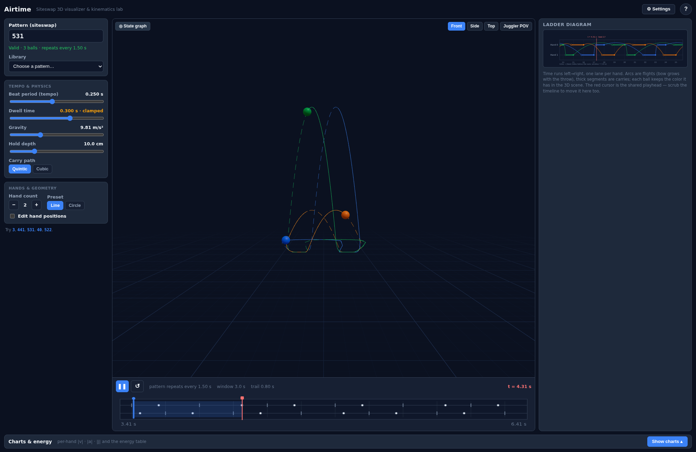
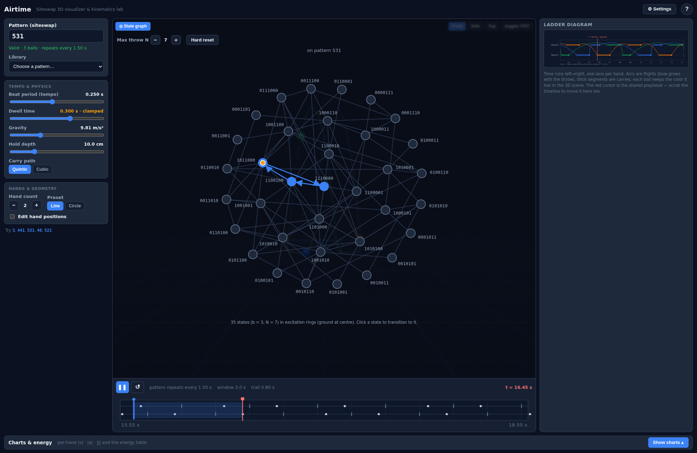
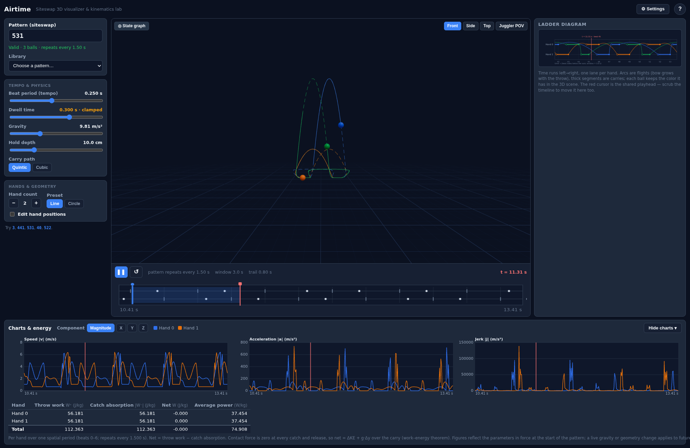

# Airtime

**An interactive 3D siteswap laboratory.** Animate juggling patterns with physically
honest timing, manipulate them live (tempo, dwell, gravity, hand geometry), navigate
the siteswap state graph by clicking, and see the kinematics no other tool shows you —
implied hand velocity/acceleration/jerk and per-hand energy. Then share the exact scene
as a link.

Airtime is a pure client-side TypeScript SPA: no backend, no external requests, no
assets — everything (including the audio ticks) is synthesized or bundled. The whole
simulation is a **closed-form function of time**, which is what makes scrubbing, trails,
live charts, deterministic playback, and pixel-identical share links essentially free.

> **Status: v1 feature-complete.** All nine build phases are in: the deterministic
> core (siteswap, timing, event timeline, kinematics, energy, state graph), the 3D
> scene, ladder diagram, timeline bar with trails/ghosts, live runtime physics, per-hand
> charts + energy panel, click-to-transition state graph, and — this phase — save/share
> (URL codec, presets, JSON, PNG), synthesized audio ticks, the pattern library, a help
> overlay, and a GitHub Pages deploy. Built phase-by-phase by AI agents; see `PLAN.md`
> (what) and `BUILD_LOG.md` (progress).

## Features

- **Vanilla async siteswap** (`0–9`, `a–z`) with live validation and beat-accurate
  error messages (it names the colliding beats).
- **3D scene** — balls only (no hands/juggler), navigable orbit camera with front /
  side / top / juggler-POV presets, single-color or per-orbit coloring, ground grid.
- **Live runtime physics** — beat period (slew-limited: watch a pattern rise as it
  slows), dwell time (with the effective-dwell clamp shown in amber), gravity, hold
  depth, quintic vs cubic carry path. Changes affect *future* events only, so history
  stays scrubbable and balls already in the air keep their parabola.
- **1–8 hands** with line/circle presets and a draggable per-hand catch/throw editor.
- **Ladder diagram** — time-vs-hands event chart (the engine's debug view).
- **Timeline bar** — a fixed, configurable window with a scrub playhead and a
  detachable trail-length handle; ball trails and dashed future ghosts.
- **Charts + energy** — per-hand |v|/|a|/|j| (magnitude or per-axis) over the timeline
  window, plus a per-hand energy table (throw work, catch absorption, net, avg power).
- **State graph** — the (b, N) landing-schedule graph with the running cycle
  highlighted and a marker that hops each beat. Click any state or pattern (or type a
  same-ball-count pattern) and Airtime plans the shortest legal transition and splices
  it into the running timeline — the past stays bit-identical, the pattern morphs
  without a glitch.
- **Pattern library** — a curated, named menu (2–5 balls) that routes through the same
  smooth-transition machinery.
- **Save / share** — a versioned URL that reproduces the whole scene, named
  localStorage presets, JSON export/import, and a PNG frame capture.
- **Audio** — synthesized throw (and optional catch) ticks, scheduled against the
  WebAudio clock so they stay aligned with the throws; master toggle + volume.
- **Help overlay** — the `?` button explains siteswap and every control group.

## Layout

Airtime is **dark by default** and lays out in a single no-scroll window (sized for a
landscape ~2000×1300 display; smaller windows collapse panels or scroll gracefully):

- **Left sidebar** — pattern input (with the live validation / ball-count line), the
  pattern library, **Tempo & physics**, and **Hands & geometry**.
- **Center stage** — the large 3D scene with the **timeline bar docked to its bottom
  edge** (mini-ladder, scrub playhead, detachable trail handle, period readout) and the
  prominent **play / pause + restart** transport. Camera presets sit in the scene's
  top-right corner; the **state-graph toggle** sits top-left.
- **Right column** — the ladder diagram.
- **Bottom dock** — **Charts & energy**, a collapsible dock (starts collapsed, taking ≈
  no height; expands to three side-by-side charts + the energy table).
- **State graph** — a translucent **overlay over the 3D scene** (default off), toggled
  from the scene's top-left; the ring layout, marker, status line, N stepper and hard
  reset all live in the overlay.
- **Settings drawer** (top-bar button) — theme (dark/light), playback speed, ball
  radius / color, per-ball coloring, timeline window, trail length, ghosts, and
  Save/Share + Audio. A **Help** (`?`) button sits beside it.

## Controls at a glance

| Group | Where | Controls |
|---|---|---|
| Pattern | Left sidebar | Text input (live validation), library dropdown |
| Transport | Timeline strip | Play/pause, restart |
| Tempo & physics | Left sidebar | Beat period, dwell time, gravity, hold depth, carry path (quintic/cubic) |
| Hands & geometry | Left sidebar | Hand count (1–8), line/circle preset, draggable catch/throw editor |
| View | Settings drawer | Playback speed (viewing only — not physics), ball radius, timeline window, trail length, per-ball coloring, future ghosts, single ball color |
| State graph | Scene overlay | N stepper (auto-expands, warns ≥ 9), hard reset, click-to-transition |
| Theme | Settings drawer | Dark (default) / Light |
| Save/share & audio | Settings drawer | Copy share link, Save PNG, Export/Import JSON, named presets, audio toggle + volume |

## Sharing & persistence

- **Copy share link** builds a compact versioned URL (`?v=1&…`) holding the full
  config — pattern, every slider, hand geometry, view toggles, audio settings, and the
  live camera — copies it to the clipboard (with a visible fallback field), and syncs
  the address bar. Opening that link in another browser reproduces the identical scene
  at `t = 0`. The URL is read once on boot (**URL > defaults**); a malformed URL is
  ignored parameter-by-parameter and simply falls back to defaults — it never crashes.
- **Presets** are named saves in `localStorage` (the same payload). Private-mode /
  disabled storage degrades to a no-op rather than erroring.
- **Export/Import JSON** downloads / restores that payload as a file (a browser
  download — the app writes nothing server-side); a bad file gives a clear error.
- **Save PNG** captures the current 3D frame (`preserveDrawingBuffer` keeps the buffer
  readable).

## Screenshots

Captured headless from the running app at 2000×1300 (pattern `531`, opened via a share
link) in the default dark layout:

**3D scene** — the 531 pattern mid-flight with trails and dashed future ghosts, the
timeline docked to the scene's bottom edge, and the ladder diagram in the right column:



**State graph** — the translucent overlay over the scene: the 35 states of (b = 3,
N = 7) in excitation rings, the running 531 cycle highlighted, and the beat-hopping
marker:



**Charts & energy** — the bottom dock expanded: per-hand |v|/|a|/|j| over the timeline
window, plus the per-hand energy table:



## Stack

Vite · TypeScript (strict) · React · three.js (react-three-fiber) · zustand ·
vitest + fast-check. Pure client-side SPA, statically hosted, zero backend.

The architectural heart: the whole simulation is a **closed-form function of time**
(an append-only event timeline + analytic kinematics), evaluated at any `t`. `src/core`
is pure and deterministic (no `Date.now`/`Math.random`/`performance`, time is always an
argument); the dependency direction is strictly `ui / render3d → state → core`. See
`DESIGN.md` §2 for why this is load-bearing.

## Development

```bash
npm ci
npm run dev -- --host   # LAN-accessible dev server (open the URL on your desktop)
npm run gate            # typecheck && lint && test && build — the pre-commit gate
npm run test            # vitest watch mode
```

## Deployment

Pushing to `main` runs `.github/workflows/deploy.yml`, which builds the SPA and
publishes it to GitHub Pages (enable **Settings → Pages → Source: GitHub Actions**
once). `vite.config.ts` uses `base: './'`, so assets resolve correctly under a project
subpath. The gate (`.github/workflows/ci.yml`) runs on every push and PR.

## License

MIT — see `LICENSE`.
